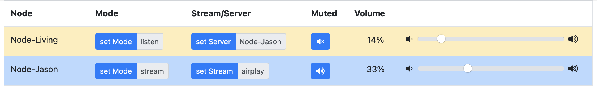
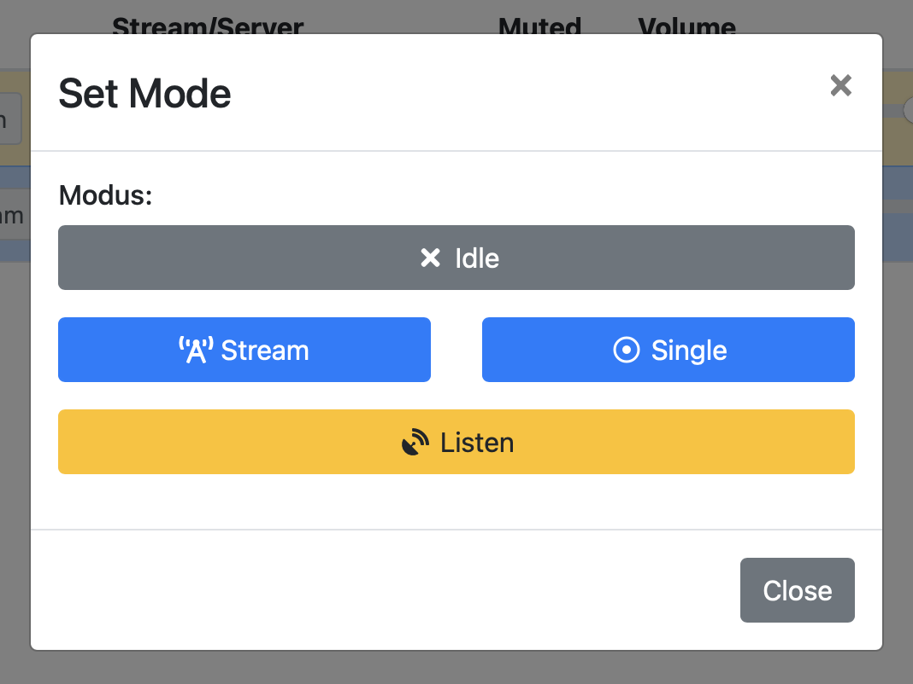

# SoundSystem

## Features

- Airplay and Bluetooth support
- Synchronous sound playback
- Synchronous sound/audio playback (airplay in single mode)
- API
- Web UI
  - Mute/Unmute
  - Control Volume
  - Stream/Single Modes
    - Airplay
    - Bluetooth
  - Listen
- Every Node can work as a streamer or just as a listener (streamer is also listening to itself)
  




## Install

```
cd ~
sudo apt update && sudo apt install -y --no-install-recommends zip
rm -rf SoundSystem
git clone https://github.com/chapterjason/SoundSystem.git
cd SoundSystem
```

Run `./install.sh`, for further information take a look into the file.

### Prerequisites

Create the database and user with a password:
Get into mysql console with: `sudo mysql`

```mysql
CREATE DATABASE soundsystem;
CREATE USER soundsystem@localhost IDENTIFIED BY 'password-here';
GRANT SELECT, INSERT, UPDATE, DELETE, CREATE, INDEX, DROP, ALTER, CREATE TEMPORARY TABLES, LOCK TABLES ON soundsystem.* TO soundsystem@localhost;
```

### Build

Change settings in the file: `~/SoundSystem/server/.env`
Build with `./build.sh`

### Supervisor

Install the supervisor service with `./services.sh`

### Update

```
git add -A
git stash
git pull --rebase
git stash pop
./build.sh
supervisorctl stop server
supervisorctl start server
```

## Add client

```
rm scripts.zip
wget http://SERVER:PORT/scripts/scripts.zip
unzip -o scripts.zip
./scripts/install.sh
```

### Reconfigure

```
./scripts/configure.sh
./scripts/client/client_configure.sh
./scripts/client/client_update.sh
```

### Update

```
./scripts/client/client_update.sh
```

# Todo

- [ ] Tests
    - [ ] Server
    - [ ] Client
    - [ ] UI
- [x] Client single mode
- [x] Mute
- [ ] Homebridge plugin
- [ ] GitHub build pipeline
- [ ] Decouple the scripts more the location (hardcoded paths in services)
- [ ] Decouple the server more in a separate user
- [ ] Own script package for server
